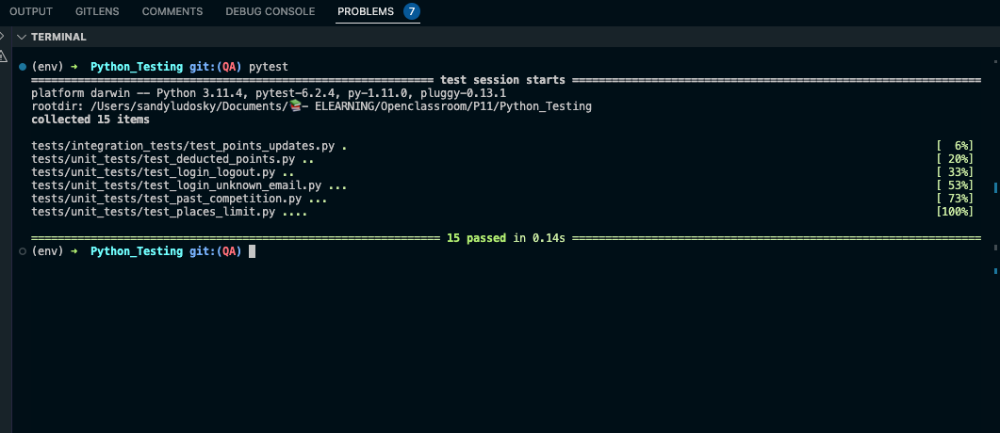

# Projet : "Améliorez un projet existant en Python"


## Pré-requis

* Installer Python 3 : [Téléchargement Python 3](https://www.python.org/downloads/)
* Installer git : [Téléchargement Git](https://git-scm.com/book/fr/v2/D%C3%A9marrage-rapide-Installation-de-Git)

## Installation

### 1. Télécharger le projet sur votre répertoire local :
```
git clone https://github.com/OpenClassrooms-Student-Center/4425126-testing-python.git
cd 4425126-testing-python
```
### 2. Mettre en place un environnement virtuel :
* Créer l'environnement virtuel:
`python -m venv venv`
`pip3 install virtualenv`

* Activer l'environnement virtuel :
    * Windows : `venv\Scripts\activate.bat`
    * Unix/MacOS : `source venv/bin/activate`


### 3. Installer les dépendances du projet
```
pip install -r requirements.txt
```

## Démarrage
* Lancer le projet Flask:

Windows/Linux
```
$env:FLASK_APP = "server.py"
flask run
```

Mac
```
export FLASK_APP=server.py
flask run
```


## Tests et Corrections
1. Executez les tests unitairs:
```
git checkout QA
pytest
```

2. Corrigez les erreurs et les bugs

les branches de test et de correction sont disponibles
```
  - master
  - QA
  - dashboard
  - past_competition
  - point_updates
  - points_allowed
  - valid_email
```

3. Couverture les tests unitaires




